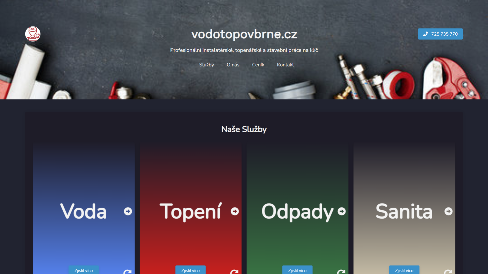

# vodotopovbrne

## Welcome to the GitHub repository for www.vodotopovbrne.cz – a plumbing company website developed with HTML, CSS, and JavaScript.

## Overview
This project showcases a modern and professional website for a plumbing company based in Brno, Czech Republic. It features a sleek dark theme, responsive design, and incorporates interactive elements to enhance user experience.

## Key Features
**Dark Theme:** The website employs a visually appealing dark theme for a modern and sophisticated look.
**Responsive Design:** The layout is designed to adapt seamlessly to various screen sizes, ensuring an optimal viewing experience across devices.
**Interactive Elements:** Utilizing JavaScript, the site includes interactive elements for a dynamic and engaging user interface.

## Technologies Used
### HTML
### CSS
### JavaScript
### PHP

## Contributing
Contributions are welcome! If you have suggestions, improvements, or bug fixes, feel free to open an issue or submit a pull request.

## License
This project is licensed under the MIT License - see the LICENSE file for details.

## Thank you for checking out VodoTopoVBrne.cz!
